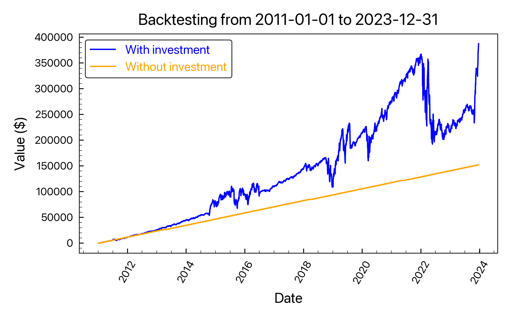
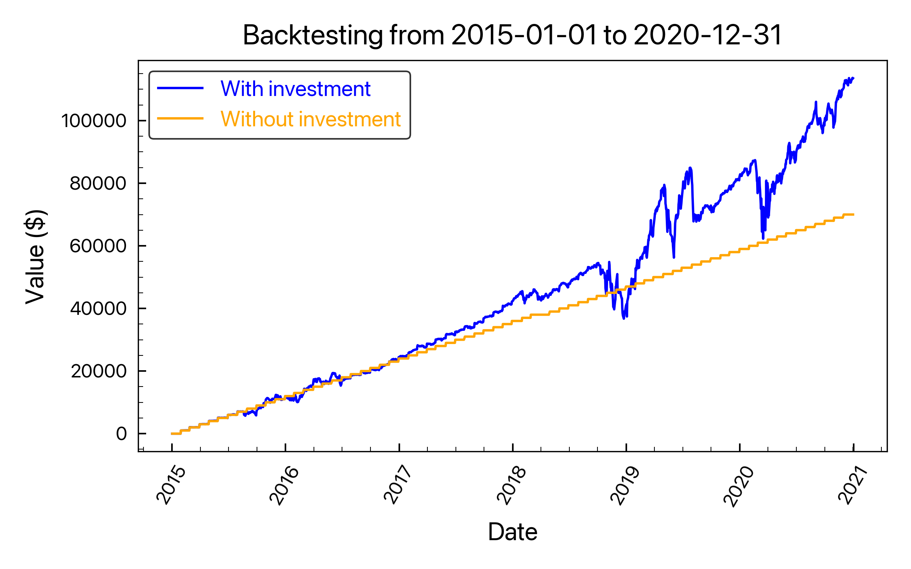

# VOO-TQQQ-Switching-Strategy-Simulator

::Interactive Streamlit app simulating investment strategies based on VOO and TQQQ switching, triggered by market indices IXIC and SPX::

`VOO`와 `TQQQ`를 기반으로 한 스마트한 투자 전략을 시뮬레이션해보는 Streamlit 웹 애플리케이션이에요. `IXIC`와 `SPX` 시장 지표에 따라 투자 전략을 변경해보며, 실제 투자 결과를 예측해볼 수 있어요.

> For who can speak english, please refer to [README-en.md](./README-en.md) for more information.

- APP LINK: https://voo-tqqq-switching-strategy-simulator-a7ufaz75r2tigq7m3zzrdq.streamlit.app/

## 프로젝트 개요

이 프로젝트에서는 `yahoo finance`의 데이터를 활용하여 `VOO`와 `TQQQ` 사이에서 전환하는 투자 전략의 효과를 시뮬레이션 해볼 수 있어요. 사용자는 원하는 기간을 설정하여 시뮬레이션을 실행할 수 있답니다.
  해당 프로젝트는 [닥터음양님의 블로그 칼럼](https://m.cafe.naver.com/ca-fe/web/cafes/likeusstock/articles/958099?useCafeId=false&tc)에서 영감을 받아 제작되었어요.

## 사용 방법

1. `Start Date`와 `End Date`를 선택하세요. 시작년도는 2011년 이후로 설정해야 해요.
2. `Run Simulation` 버튼을 클릭하세요.
3. 총 자산 가치와 월급만 합산했을 때의 가치를 비교하는 그래프와 결과 테이블을 확인하세요.

## 주요 기능

- **시뮬레이션 실행**: 사용자가 설정한 기간에 대한 투자 전략의 성과를 시뮬레이션 해볼 수 있어요.
- **결과 시각화**: 투자 결과를 직관적인 그래프로 볼 수 있어요.
- **결과 테이블**: 시뮬레이션의 구체적인 숫자 결과를 테이블 형태로 제공받을 수 있어요.

## 설치 및 실행

1. 다음 링크를 눌러, Streamlit 앱을 실행해보세요.  
[VOO-TQQQ-Switching-Strategy-Simulator](https://voo-tqqq-switching-strategy-simulator-a7ufaz75r2tigq7m3zzrdq.streamlit.app/)

2. `Start Date`와 `End Date`의 날짜를 변경해가며, 백테스팅 시뮬레이션 결과를 확인해보세요.

## 갤러리

| 2011 ~ 2023 백테스팅 결과 | 2015 ~ 2020 백테스팅 결과 |
| :---: | :---: |
|  | 
